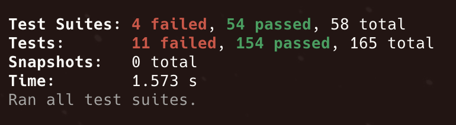
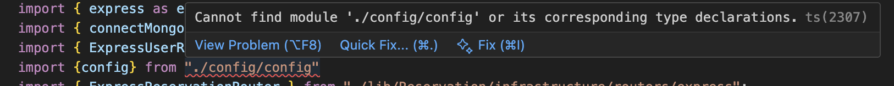

# Revisión de código
Por: [Santiago Balcero](https://github.com/Santiago-Balcero) 

#### Proyecto analizado: [TuryxEv_Back](https://github.com/DianaArevalo/TuryxEv_Back)

## Configuración del proyecto y creación de ambiente local de desarrollo ⚠️
- El archivo `README.me` no proporciona información importante para la creación de un ambiente local de desarrollo que permita a nuevas personas integrarse al equipo de trabajo. Un `README.me` de proyecto debe contener el paso a paso para descargar el repositorio, instalar dependencias, montar la o las bases de datos locales (script .sh, script .sql o archivo docker compose), ejecutar los tests y ejecutar el proyecto. Como sugerencia el `README.me` también puede incluir un listado de los endpoints principales para probar en local (curls, colección postman o mínimo ejemplos de los requests y archivos JSON esperados). Tener en cuenta que los usuarios del `README.me` no son los usuarios de la aplicación sino el equipo de desarrollo. Lectura recomendada [aquí](https://medium.com/@fulton_shaun/readme-rules-structure-style-and-pro-tips-faea5eb5d252).
- Al ser un proyecto de naturaleza compleja recomiendo seguir la especificación [OpenAPI](https://swagger.io/specification/) como parte de la documentación de los endpoints, métodos y códigos http, parámetros de las URL, objetos esperados en los cuerpos de la petición y objetos esperados como respuesta. Ejemplo [aquí](https://petstore.swagger.io/).
- Al descargar el repositorio, estar parado sobre la rama `develop` el `11 de Noviembre de 2025 a las 7:30am` y ejecutar los tests con `npm run test` se encuentra que hay varios tests que no funcionan. Recomiendo incorporar un pipeline con GitHub actions que valide la ejecución de los tests al abrir un Pull Request a la rama `develop` y a la rama `main`. 
- Al descargar el repositorio, estar parado sobre la rama `develop` el `11 de Noviembre de 2025 a las 7:30am` y ejecutar el proyecto con `npm run dev` se encuentra que el proyecto no compila debido al error en la imagen. Recomiendo incorporar un pipeline con GitHub actions que valide que el proyecto compila y se inicia correctamente al abrir un Pull Request a la rama `develop` y a la rama `main`. 
- Al arreglar el error el proyecto sigue sin compilar debido a que falla la conexión con MongoDB. 
- Recomiendo que la rama develop esté siempre estable: tests se ejecutan correctamente, el proyecto compila y se inicia el servidor.

## Elección de base de datos ⚠️
- El proyecto actualmente se conecta a una base de datos no relacional (Mongo DB). Esta puede no ser la mejor elección para un proyecto con las características de este. Un sistema de reservas y pagos tiene procesos que ejecutan mútiples lecturas, inserciones y actualizaciones de registros que necesitan de las características ACID (atomicidad, consistencia, aislamiento y durabilidad) que tienen larga trayectoria en las bases de datos relacionales. Referencias sobre ACID [aquí](https://medium.com/@artemkhrenov/acid-properties-explained-building-reliable-database-transactions-08fdeb9d3153) y [aquí](https://www.datacamp.com/blog/acid-transactions). Recomiendo evaluar la posibilidad de mirgrar a un motor de base de datos relacional.
- En el ecosistema fintech, bancario tradicional y de pagos el estándar es manejar los modelos de datos del core con bases de datos relacionales por sus características ACID. Lecturas recomendadas: [paper académico](https://www.academia.edu/126688677/SQL_vs_NoSQL_Databases_Choosing_the_Right_Option_for_FinTech#:~:text=SQL%20databases%20are%20very%20suitable,and%20strategies%20for%20future%20growth.), [artículo en Medium](https://medium.com/@keemsisi/the-ideal-database-for-financial-transactions-unraveling-the-best-options-d5fef359fe09). En caso de requerirse puede adoptarse una arquitectura en la que el core de procesamiento de pagos y reservas se maneje con una base de datos relacional y otras características como comentarios, reseñas y mensajes entre usuarios se manejen con una base de datos no relacional.
- Recomiendo añadir un archivo docker compose al repositorio para montar de manera fácil la base de datos en local a través de un contenedor dado que es la manera más ágil y rápida de hacerla disponible para el desarrollo. Referencias y ejemplos [aquí](https://medium.com/@akshatgadodia/simplify-database-management-with-docker-compose-a-comprehensive-guide-f33816ff4bc3).

## Observabilidad ❌
- El proyecto no cuenta en absoluto con un sistema de logging, métricas o trazas. Esto hace que al poner el proyecto en producción o incluso en un ambiente de pruebas no haya manera alguna de saber qué está pasando con la aplicación en tiempo real. Los logs ayudan a entender el comportamiento, detectar errores y hacer auditorías. El ciclo de vida del desarrollo de software incluye el monitoreo y la observabilidad como herramientas claves para el mantenimiento y futuras iteraciones de los sitemas. Recomiendo dar prioridad a este ítem y no poner el proyecto en ambiente productivo hasta tanto no se tenga un mínimo de observabilidad. Recomiendo manejar logs estructurados por request. Lectura recomendada sobre logs estructurados [aquí](https://stripe.com/blog/canonical-log-lines).

## Estilo de código y linter ❌
El repositorio carece de dos configuraciones importantes para ayudar a mantener la calidad del código y un estilo consistente que facilite su lectura sin importar qué tan grande sea el equipo de trabajo. `ESLint` es un linter que ayuda a mantener buenas prácticas y a detectar problemas con la calidad del código, documentación [aquí](https://eslint.org/). `Prettier` es una herramienta para el formateo automático del código para mantener un estilo consistente en los archivos, documentación [aquí](https://prettier.io/docs/). Ambas son solo dos opciones entre muchas y requieren sencillos archivos de configuración. Recomiendo su uso dado que la revisión general de los archivos revela un estilo inconsistente. También recomiendo la instalación y uso de las extensiones de VS Code/Cursor `Prettier - Code formatter` (extensión oficial de Prettier) y `ESLint` (extensión oficial de Microsoft).

## Configuración de TypeScript ⚠️

El archivo `tsconfig.json` tiene varias configuraciones comentadas que podrían mejorar significativamente la calidad del código y detectar errores tempranamente:

**Configuraciones recomendadas para habilitar:**
- `"noUnusedLocals": true` - Detecta variables locales no utilizadas.
- `"noUnusedParameters": true` - Detecta parámetros de función no utilizados.
- `"noImplicitReturns": true` - Requiere return explícito en todas las ramas.
- `"exactOptionalPropertyTypes": true` - Manejo más estricto de propiedades opcionales.
- `"noUncheckedIndexedAccess": true` - Añade 'undefined' a tipos accedidos por índice.

**Problemas identificados:**
- La inclusión `"Hotel/**/*"` es inconsistente con la estructura del proyecto (`/src/lib/Hotel/`).
- Debería ser solo `"src/**/*"` para mantener consistencia.

## Archivo configEjemplo.ts ❌
El nombre del archivo es confuso. ¿Por qué `...Ejemplo`?  

```typescript
// Estos valores deberían hacer parte del .env y ser leídos desde allí.
export const config = { // Este objeto de configuración debería estar tipado.
  mongoUri: "MONGO_URI_HERE", // Valor quemado, mala práctica
  port: 3000 // Valor quemado, mala práctica
};
```

Versión mejorada:  
```typescript
// ----- Archivo main.ts
import { loadEnvFile } from "process";

// Antes de cualquier otro import que use variables de entorno
// esto asegura que lo primero que haga el programa es cargar el archivo de variables de entorno
loadEnvFile('.env'); 

// ----- Archivo configEjemplo.ts
// Da la seguridad de saber qué tipo de dato va a tener cada campo de la configuración
export interface ServerConfig { 
  mongoUri: string;
  port: number;
}

const getEnvVar = (name: string): string => {
  const value = process.env[name];
  if (!value) {
    // Es importante que el manejo de errores siempre sea explícito
    // si una variable de entorno requerida no se puede cargar el programa no debería avanzar en su ejecución
    throw new Error(`Environment variable ${name} is required but not set`);
  }
  return value;
};

export const config: ServerConfig = {
  mongoUri: getEnvVar("MONGO_URI"),
  port: parseInt(getEnvVar("SERVER_PORT"), 10),
};
```

## Archivo src/lib/Shared/Infrastructure/External.ts ❌
```typescript
import argon2 from "argon2";
import cors from "cors";
import * as dotenv from "dotenv"; // No es necesaria
import express from "express";
import mongoose from "mongoose";

export { argon2, cors, dotenv, express, mongoose };
```
Este archivo no aporta nada en absoluto. Todo esto se puede importar directamente desde los lugares donde se necesite. No recomiendo usar este tipo de archivos `barrel exports`. Es más limpio el código al importar dependencias, funciones, constantes allí donde se necesite. Los `barrel exports` tienen sentido al escribir librerías y este no es el caso. Referencia [aqui](https://tkdodo.eu/blog/please-stop-using-barrel-files).  

La dependencia `dotenv` no es necesaria para leer archivos `.env` desde `node 20.6+`. Ver ejemplo en la sección anterior respecto al archivo de configuración.

## Archivo main.ts ⚠️
Este archivo debe ser lo más limpio posible y actualmente inluye muchas cosas que deben ir en archivos separados para mejor organización del código.
```typescript
app.use("/api/business", ExpressBusinessRouter);
app.use("/api/users", ExpressUserRouter);
app.use("/api/reservations", ExpressReservationRouter);
app.use("/api/hotel", ExpressHotelRouter);
```
Esto debe ir en un archivo separado que se encargue de registrar todas las rutas de la aplicación.  

```typescript
app.use(
  (err: unknown, req: ex.Request, res: ex.Response, next: ex.NextFunction) => {
    if (err instanceof HttpError) {
      const response: ApiResponse<null> = {
        success: false,
        title: "Ocurrio un error",
        message: err.message,
        body: null,
      };

      return res.status(err.statusCode).json(response);
    }

    if (err instanceof Error) {
      console.error(err.stack);
      return res.status(500).json(err.message);
    }
    console.error(err);
    return res.status(500).json("Something wrong!");
  }
);
```
Esto podría ir en un archivo `middlewares.ts`.  

Este archivo combina `strings` en inglés y español a modo de mensajes en las respuestas: `"Ocurrio un error"` (error de ortografía) y `"Something wrong!"`. Recomiendo retornar todos los mensajes en el mismo idioma. Recomiendo máxima atención a la ortografía, sobre todo si se piensa mostrar estos mensajes en la UI.

## Definición de entidades ❌
### Ejemplo archivo `src/lib/Hotel/domain/entities/Hotel.ts`
La definición de entidades de dominio, tomando como ejemplo la entidad `Hotel`, presenta un exceso de sobreingeniería totalmente innecesario. Es como si se estuviera forzando a Typescript a comportarse como Java y además forzando la incorporación de patrones de Programación Orientada a Objetos que crean complejidad innecesaria en el desarrollo, legibilidad y mantenibilidad del código. Esta complejidad no justificada para esta definición de una entidad de negocio además degrada el performance. La entidad `Hotel` también presenta un error fundamental de diseño: mezcla características de negocio (`name`, `location`, `score`, `status`) con características de autenticación (`email`, `password`). Idealmente la tabla `Hotel` debe representar las características de negocio del hotel, se recomienda la creación de una entidad `HotelUser` para gestionar los datos de autenticación (`email`, `password`) y de contacto del hotel. Los datos de contacto del hotel de cara a la administración del sistema (soporte técnico, representación legal, actualización de datos, etc) no necesariamente son los mismos que los datos de contacto de cara a los huéspedes del hotel.

### Problema Principal:
El código fuerza TypeScript a comportarse como Java enterprise tradicional, perdiendo las ventajas y simplicidad del ecosistema JavaScript moderno.

**Patrones Java Identificados:**
- **Value Objects excesivos**: Cada primitivo envuelto en una clase sin justificación, no tiene ningún sentido al tratarse de datos simples.
- **Interface + Class duplicación**: Patrón Java enterprise innecesario.
- **Getter/Setter verbosidad**: `getValue()` en lugar de acceso directo.
- **Type casting masivo**: Indica diseño incorrecto, degradación de performance y abre la puerta a errores en tiempo de ejecución totalmente evitables con un diseño más limpio.

### Impacto Negativo:
- **Complejidad innecesaria**: 100+ líneas para crear un objeto simple.
- **Performance degradada**: Instanciación masiva de objetos.
- **Experiencia de desarrollo pobre**: Verbosidad extrema.
- **Mantenibilidad reducida**: Demasiadas capas de abstracción.

### Recomendación:
**Adoptar filosofía TypeScript moderna:**
- Usar primitivos con tipos estratégicos.
- Value Objects solo para lógica de negocio compleja.
- Aprovechar structural typing y union types.
- Priorizar siempre la simplicidad sobre la abstracción innecesaria.

**Referencias:**
- [TypeScript Handbook - Everyday Types](https://www.typescriptlang.org/docs/handbook/2/everyday-types.html)
- [Effective TypeScript](https://effectivetypescript.com/)

### Ejemplo de entidad `Hotel` simplificada
```typescript
export type HotelPlan = 'FREE' | 'PREMIUM' | 'ENTERPRISE';
export type HotelStatus = 'ACTIVE' | 'BLOCKED' | 'SUSPENDED';

// Nótese que ya no hay campo password en esta entidad de negocio
// Tampoco hay role en esta entidad de negocio, la categoría staff se vuelve una entidad independiente acorde a su caso de uso
// Tampoco hay hotel provider data acá pues corresponde a una caraacterística relacionada con la autenticación
export interface Hotel {
  id: string; // HotelID es redundante
  name: string;
  // Email de cara a los clientes del hotel
  // diferente al email de contacto para administración en la plataforma
  email: string;
  // En la implementación actual Location solo incluye ciudad
  // hay que añadir calle, número, municipio, departamento, coordenadas (si se quiere geolocalizar en un mapa en la UI)
  location: Location;
  // Tiene que ser lista si se quiere que el hotel tenga múltiples imágenes
  // en la BD acá se guardan URLs de un sistema de almacenamiento externo
  // Optimización real sugerida: tabla Images con campos: entity_type(hotel, restaurante, etc), entity_id(id del hotel, restaurante, etc), url(url de donde se encuentra guardada la imagen)
  picture: []string;
  plan: HotelPlan;
  status: HotelStatus;
  score: number;
  createdAt: Date;
  updatedAt: Date;
  // Se sugiere añadir deletedAt como posible campo nulo para manejar los soft delete que puedan asociarse a la cancelación temporal o permanente del hotel en la plataforma
  deletedAt?: Date | null;
  freePlanEnd: Date;
  // Foreign key de una nueva tabla encargada de la autenticación, administración y gestión del hotel en la plataforma
  // también podría manejarse con una tabla intermedia si la relación es muchos a muchos entre hoteles y administradores
  hotelUserId: number;
}

// Ejemplo de instanciación sencilla sin necesidad de método constructor
// En caso de querer manejar las entidades como clases, se puede usar el método constructor
// siempre priorizando la simplicidad en la definición de los tipos de datos
const hotel: Hotel = {
  id: generateId(),
  name: "Hotel California",
  email: "info@hotelcalifornia.com",
  plan: "PREMIUM",
  status: "ACTIVE",
  score: 4.5,
  createdAt: new Date(),
};
```

### Violaciones de Seguridad CRÍTICAS:
- **Password en entidad de dominio** - Riesgo de exposición.
- **Password en respuesta toResponse()** - Violación grave de seguridad.
- **Credenciales mezcladas con datos de negocio.**

### Plan de Migración Sugerido:
1. **Fase 1**: Separar autenticación (HotelUser) del dominio Hotel.
2. **Fase 2**: Simplificar value objects críticos (mantener Email, Location).
3. **Fase 3**: Eliminar value objects innecesarios (Name, Score, etc.).
4. **Fase 4**: Refactoring de servicios y repositorios.

## Caso de uso crítico: creación de reserva ❌
### Archivo `src/lib/Reservation/application/create-reservation.ts`
La capa de servicio (caso de uso, lógica de negocio) es una capa que no cumple su función en su actual implementación. Se limita a crear un objeto y pasarlo a la capa de acceso a datos sin validaciones de negocio mínimas (descritas más adelante en ejemplo de código). También carece de manejo de errores (`try`/`catch`). De nuevo presenta una sobreingeniería que añade complejidad innecesaria para el manejo de datos primitivos. Crear una clase para cada caso de uso puede agregar complejidad innecesaria en este punto de desarrollo del proyecto. En el desarrollo backend con Typescript no es común el uso de `...Props` (más reservado para los props de componentes de frontend), sugiero cambiarlo por `...Request`.  
El código también carece de un elemento fundamental en el diseño e implementacieon de sistemas backend: validación de inputs. Estos inputs vienen del frontend pero ¿cómo sabe el backend que puede confiar en estos datos y su integridad? Debe haber validación.  
En la implementación de capas de servicio es muy importante hacerse preguntas de tipo "¿qué pasa sí?". Ejemplos: ¿qué pasa si llegan dos peticiones simultáneamente para la misma habitación del mismo hotel y en las mismas fechas?, ¿qué pasa si el usuario está inactivo?, ¿qué pasa si el hotel ya está lleno?  
Recomiendo un refactor completo de este caso de uso teniendo en mente lógica de negocio real (con alcance de un MVP) y programación defensiva. Referencia de programación defensiva [aquí](https://medium.com/@sophiadizon/defensive-coding-approach-43bf3f3c007d). Referencias de idempotencia [aquí](https://medium.com/@reetesh043/rest-api-design-what-is-idempotency-18218e1ff73c) y [aquí](https://www.designgurus.io/answers/detail/how-do-you-design-idempotent-apis-and-why-is-idempotency-important-in-distributed-systems?gad_source=1&gad_campaignid=23163907085&gbraid=0AAAAADME9yp6CjayWrJi9-ka9bhTGSDZV&gclid=Cj0KCQiA5uDIBhDAARIsAOxj0CFJJDq0GCYZlIqpga70s9c7UZetvmXEpKfPggyGhO3H0yiZOYmXSfEaAr4dEALw_wcB).

### Implementación de lógica de negocio:
Recomiendo los siguientes pasos para la implementación de una lógica de negocio funcional.
1. Lo primero es usar una llave de idempotencia que permita saber si esta reserva ya fue procesada o no. Se consulta la tabla de reservas y si la idempotency key ya existe la reserva ya fue procesada. Esta tabla por su naturaleza es altamente transaccional por lo cual crecerá rápidamente con el tiempo y debe tener índices para una búsqueda más rápida. Para este paso es indispensable tener un índice sobre la colomna `idempotency_key`.
2. Validar el input. Esto debería ir en un método independiente dentro de este caso de uso (archivo). Validar que las fechas de check in y check out sean en el futuro (no pueden ser fechas en el pasado respecto al momento de creación de la reserva), validar que la fecha de check out sea posterior a la fecha de check in, validar que todos IDs del request sean diferentes a 0, validar que el número de huéspedes sea mayor o igual a 1, validar que el valor de la reserva no sea 0 (en caso de que el valor ya se haya calculado teniendo en cuenta tarifas, impuestos, deducciones, comisiones, descuentos, costos de transacción).  
En entornos reales el valor total calculado de la reserva debe guardarse en una tabla histórica y de auditoría dado que los precios que da el hotel por sus servicios, impuestos, comisiones, etc, varían con el tiempo.
3. Mínimo se debe validar el estado de cuenta del usuario. Verificar que el usuario esté activo en el sistema y como opcionales: Opcionales: que el usuario no tenga otras reservas activas en esta fecha, que el usuario no tenga pagos pendientes de reservas anteriores. Lo que se busca es saber que el ususario está realmente habilitado para la creación de una reserva nueva. En entornos reales en este punto se suelen validaciones de riesgo y fraude en relación a la cuenta del usuario en el sistema usando servicios de terceros para verificación de identidad digital.
4. Mínimo se debe validar el estado de cuenta del hotel. Verificar que el hotel esté activo en el sistema. Lo que se busca es saber que el hotel está habilitado para recibir una reserva desde el punto de vista de salud de la cuenta del hotel en el sistema (diferente a la disponibilidad de habitaciones).
5. Se debe validar que el hotel tenga disponibilidad para las fechas, número de huéspedes y habitación (o tipo de habitación). En este punto es imporante garantizar que si otra reserva llega para el mismo hotel, fechas y habitación, el sistema no genere doble reserva. Lo mismo aplica en caso de que la comunicación entre cliente y servidor falle y el usuario reintente. Se debe garantizar la idempotencia de la operación, sin importar qué suceda, este proceso debe garantizar que si todas las validaciones pasan se genere una única reserva. Es importante verificar que esta misma reserva no haya sido ya creada en el sistema. ¿Qué pasa si en mitad de este proceso se apaga el servidor o falla alguno de los pasos(esto en teoría es una API restful y debe poderlo manejar)? ¿Qué pasa si el número de huéspedes del request es mayor al que el hotel puede aceptar en esa habitación?  
En este punto debe hacerse un lock sobre el sistema de inventario de habitaciones del hotel para que en caso de que una segunda reserva llegue al mismo tiempo, solo una de ellas sea exitosa previniendo overbooking en la misma habitación. Al finalizar este proceso, sin importar el resultado, debe liberarse el lock sobre la habitación. En caso de éxito el lock libera la habitación y la reserva queda guardada exitosamente. En caso de falla el lock libera la habitación para nuevos intentos de reserva y la reserva no se guarda.
6. Si el valor de la reserva no se ha calculado, debe calcularse teniendo en cuenta tarifas, impuestos, deducciones, comisiones, costos de transacción y guardar el cálculo en una tabla.
7. Cobrar la reserva o al menos hacer un ping a la tarjeta de crédito o método de pago que el cliente tenga registrado en la plataforma. Si no tiene ninguno, el request debe incluir información del medio de pago a usar para esta transacción.
8. Finalmente guardar la reserva en la base de datos. Debe defiinirse una estrategia de gestión del inventario de habitaciones disponibles por hotel.
9. En cualquier caso de error debe hacerse rollback a cualquier escritura en BD (excepto tal vez la del cálculo del valor de la reserva). En caso de éxito se hace commit a la transacción en la BD para efectivamente guardar los datos necesarios. Por esto es importante el uso de una BD con amplio soporte de transacciones para garantizar la atomicidad de la información y el estado coherente de los datos en todo momento.

### Impacto en Producción:
- **Pérdida de dinero**: reservas gratis, dobles reservas para una misma petición, overbooking.
- **Experiencia de usuario pobre**: reservas inválidas, conflictos y errores no controlados.
- **Problemas operacionales**: sistema roto sin posibilidad de recuperación ya que no hay manejo de errores (try/catch).

### Cambio sugerido:
```typescript
interface CreateReservationRequest {
  idempotencyKey: string; // generado por el cliente para garantizar la idempotencia de la transacción
  userId: string;
  hotelId: string;
  checkInDate: Date;
  checkOutDate: Date;
  // Este input carece de datos fundamentales y críticos para cualquier sistema de reserva
  // A continuación algunos sugeridos:
  roomID: numnber; // o al menos un roomType: string
  guestCount: number; // cómo sabe el hotel cuántos huéspedes va a recibir sin este dato?
  totalAmount: number; // precio de la reserva, fundamental para el cálculo de tarifas, impuestos, ping a la tarjeta de crédito, etc
  specialRequests: string; // el usuario tiene la posibilidad de hacer peticiones especiales?
}

export class CreateReservation {
  constructor(
    private readonly reservationRepository: ReservationRepository,
    private readonly hotelService: HotelService,
    private readonly userService: UserService,
    private readonly availabilityService: AvailabilityService,
    private readonly pricingService: PricingService,
    private readonly paymentService: PaymentService,
    private readonly logger: Logger
    ) {
      // Creación de la instancia
    }

  async handler(request: CreateReservationRequest) {
    // 1. usarReservationRepository y la idempotencyKey para verificar que no se haya procesado ya esta misma reserva.

    // 2. Validar input.
  
    // 2.Usar userService para validar el estado de cuenta del usuario.

    // 4. Usar hotelService para validar el estado de cuenta del hotel.

    // 5. Usar availabilityService para verificar la disponibilidad  del hotel para las fechas, tipo de habitación (o número de habitación) y número de huéspedes del hotel.

    // 6. Usar princingService para determinar el valor de la reserva en caso que no se haya calculado antes.

    // 7. Usar paymentService para realizar el pago de la reserva o al menos un ping a la tarjeta de crédito para verificar la validez del método de pago.

    // 8. Finalmente sí crear la reserva en la BD. El estado pending es correcto hasta tanto no se reciba confirmación del pago, el ususario cancele o algo falle.
    const now = new Date(Date.now());
    const createdAt = ReservationCreatedAt.create(now);

    const reservation = new Reservation({
      reservationId: new ReservationId(""),
      userId: new ReservationUserId(props.userId),
      hotelId: new ReservationHotelId(props.hotelId),
      checkInDate: ReservationCheckInDate.create(props.checkInDate),
      checkOutDate: ReservationCheckOutDate.create(
        props.checkOutDate,
        props.checkInDate
      ),
      status: ReservationStatus.create(),
      totalAmount: ReservationTotalAmount.create(0),
      createdAt: createdAt,
      updatedAt: ReservationUpdatedAt.now(createdAt),
    });

    const created = await this.repository.create(reservation);

    return created.toResponse();
  }
}

```